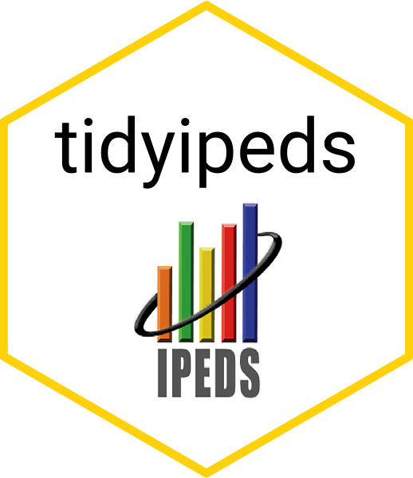

<!-- README.md is generated from README.Rmd. Please edit that file -->

# tidyipeds 

-----

A tidy solution for using the Integrated Postsecondary Education Data
System from the National Center for Education Statistics. Includes easy
integration with the College Scorecard, American Community Survey (ACS),
and the Urban Institute’s Education Data API.

\=======================

# Goals

1.  Download raw IPEDS data and do the minimum to restructure to a
    consistent tidy format. This is most useful for individuals who want
    every table and variable in raw, un-curated IPEDS data in a format
    that allows easy joins and the option for longitudinal analysis.
    This data should be used by individuals familiar with the changes in
    IPEDS over the years as some variables change in definition or
    category values over time.

2.  Allow easy joining of American Community Survey (ACS) data and other
    higher ed data (i.e. College Scorecard) to IPEDS data.

3.  Provide acces to the Urban Institute’s Education Data API for IPEDS
    data. This data is curated to allow safer longitudinal analyses,
    however at present it is missing some of the IPEDS surveys, most
    notably financial data. Urban is currently working to add additional
    data so this source may replace the direct IPEDS raw data in the
    future.

4.  Allow easy geographic mapping of IPEDS variables and schools
    (pending).

\=======================

# Raw IPEDS data

There are a number of issues to address in order to take the raw IPEDS
tables and convert them to a more useful structure. These include:

  - Applying useful variable names to the column titles in place of the
    codes (ie change codes like “EFDETOT” to “All students enrolled”)
    based on the IPEDS data dictionary.

  - Re-aligning survey tables that include multiple years of data in
    separate columns.

  - Recoding the categorical variable values from codes to readable
    values.
